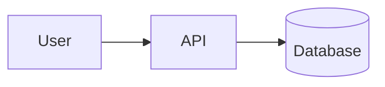

# Insert Mermaid Diagrams

## Workflow

1. Identify the input mode, desired diagram purpose, and requested output mode:
   - Text input: derive the diagram from prose, requirements, schemas, code context, or other written source material.
   - Image input: derive the diagram from an attached image, screenshot, photo, or local image path that contains a diagram.
   - Markdown mode: insert or update a Mermaid fenced code block in a `.md` or `.markdown` file.
   - Standalone file mode: create or update a raw Mermaid source file when the user asks for a separate file.
   If the target file, input mode, or output mode cannot be inferred, ask one concise question before editing.
2. For Markdown mode, inspect the surrounding Markdown before changing it. Preserve existing headings, prose, comments, and unrelated code fences.
3. For image input, inspect the image before drafting Mermaid. Identify the visible diagram type, nodes, labels, arrows, swimlanes or actors, states, entities, and directionality.
4. Choose the Mermaid diagram type that best matches the source:
   - Use `flowchart TD` or `flowchart LR` for processes, architecture, dependency flow, or decision logic.
   - Use `sequenceDiagram` for ordered interactions between people, services, APIs, or systems.
   - Use `stateDiagram-v2` for lifecycle/status transitions.
   - Use `erDiagram` for database entities and relationships.
   - Use `timeline`, `gantt`, or `mindmap` only when the source naturally calls for chronology, scheduling, or hierarchy.
   - Read `references/diagram-patterns.md` when unsure which syntax shape to use.
5. Draft Mermaid from the source facts only. Keep labels short, quote labels with spaces or punctuation, and split overloaded diagrams into multiple focused blocks.
6. In Markdown mode, insert or update an anchored Markdown block. Use a stable lowercase id such as `request-flow`, `training-pipeline`, or `db-model`.

````markdown
<!-- mermaid-diagram: request-flow -->

<!-- /mermaid-diagram: request-flow -->
````

7. In standalone file mode, write raw Mermaid only. Do not wrap it in a Markdown fence, add HTML anchors, or include explanatory prose.
8. Verify the result after editing. For Markdown mode, confirm the opening and closing anchors match, the Mermaid fence is closed, and the diagram code contains no Markdown-only formatting. For standalone file mode, confirm the file contains only Mermaid source.

## Image Inputs

Use image input mode when the user attaches or points to an image that already contains a diagram.

- Use only visible information from the image. Do not invent missing labels, systems, relationships, statuses, dates, actors, or arrow directions.
- Preserve the diagram's intended structure over pixel-perfect layout.
- Ask one concise question or request a clearer image when labels or connections are unreadable and materially affect the diagram.
- If the image looks like a flowchart, sequence diagram, state machine, entity relationship diagram, timeline, or mindmap, choose the closest Mermaid type using the selection guidance above.
- Ignore decorative styling, colors, icons, line thickness, and shadows unless they encode meaning in the diagram.
- If the image mixes multiple diagrams, split them into multiple focused Mermaid blocks or files when the requested output allows it.

## Standalone Mermaid Files

Use standalone Mermaid files when the user asks for a separate diagram file, source file, `.mmd`, or `.mermaid` output.

- Use `.mmd` or `.mermaid` extensions only. Default to `.mmd` when the user requests a Mermaid file without specifying an extension.
- Write raw Mermaid source only, unless the user explicitly asks for Markdown.
- Replace the target file with the requested diagram source by default.
- Preserve unrelated existing file content only when the target is clearly intended to contain multiple diagrams.
- Do not use Markdown anchors or fenced code blocks in standalone Mermaid files.

## Insertion Helper

Use `scripts/update_mermaid_block.py` for deterministic file edits when a target Markdown file is available. Pass raw Mermaid in a `.mmd` or `.mermaid` file; the script also accepts a fenced Mermaid block and extracts the first Mermaid fence.

```bash
python scripts/update_mermaid_block.py \
  --file README.md \
  --id request-flow \
  --diagram-file request-flow.mmd \
  --after-heading "## Architecture" \
  --title "Request Flow"
```

Behavior:

- Replace the existing `<!-- mermaid-diagram: id --> ... <!-- /mermaid-diagram: id -->` block when it exists.
- Insert a new block under `--after-heading`, before `--before-heading`, or at the end of the file.
- Use `--replace-only` when the user explicitly asked to update an existing diagram and a missing block should be an error.
- Use `--dry-run` to print the resulting Markdown without writing it.
- For standalone `.mmd` or `.mermaid` outputs, write the raw Mermaid file directly instead of using this Markdown insertion helper.

## Quality Rules

- Prefer readable diagrams over exhaustive diagrams. A useful diagram should make the source text easier to scan.
- Do not invent systems, relationships, statuses, dates, or actors that are not present in the source.
- Do not render to SVG/PNG or add generated images unless the user asks for image output.
- Do not claim a diagram was visually rendered unless a Mermaid-capable preview, docs build, or browser check actually rendered it.
- When the repo has a docs preview, Markdown linter, Mermaid CLI, or test command, run the relevant check after editing.
