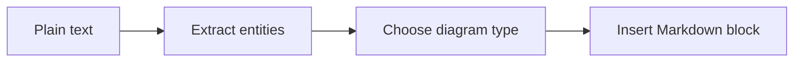
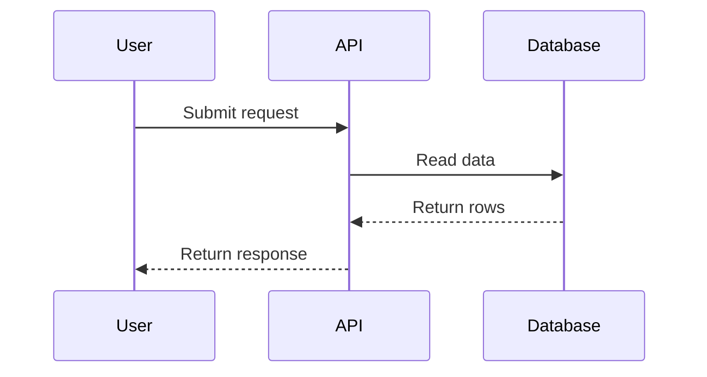
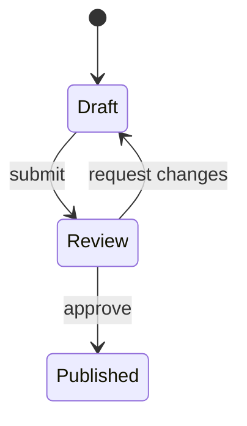
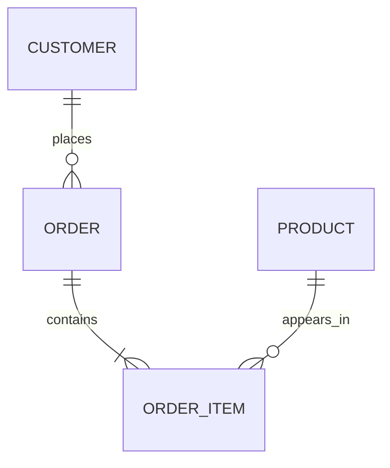

# Mermaid Diagram Patterns

Read this reference when choosing a diagram type or shaping Mermaid syntax from prose.

## Selection

| Source shape | Prefer | Notes |
| --- | --- | --- |
| Step-by-step process | `flowchart TD` | Use top-down when order matters. |
| System/data flow | `flowchart LR` | Use left-to-right for pipelines and service flows. |
| API or actor interaction | `sequenceDiagram` | Keep messages short and chronological. |
| Status lifecycle | `stateDiagram-v2` | Model states as nouns and transitions as events. |
| Database model | `erDiagram` | Include only relationships stated or discoverable in schema. |
| Schedule or roadmap | `gantt` | Use only when dates or durations are supplied. |
| Chronological milestones | `timeline` | Use when the text is event history rather than a project plan. |
| Concept hierarchy | `mindmap` | Use for taxonomies, not process flow. |

## Common Shapes

Flowchart:

Sequence:

State:

Entity relationship:

## Labeling

- Use stable node ids such as `api`, `load_data`, or `feature_store`.
- Quote labels that contain spaces, punctuation, or parentheses: `api["Prediction API"]`.
- Keep labels short. Move details into surrounding Markdown instead of overloading nodes.
- Avoid Mermaid reserved words as ids, including `graph`, `flowchart`, `end`, `subgraph`, `class`, and `state`.
